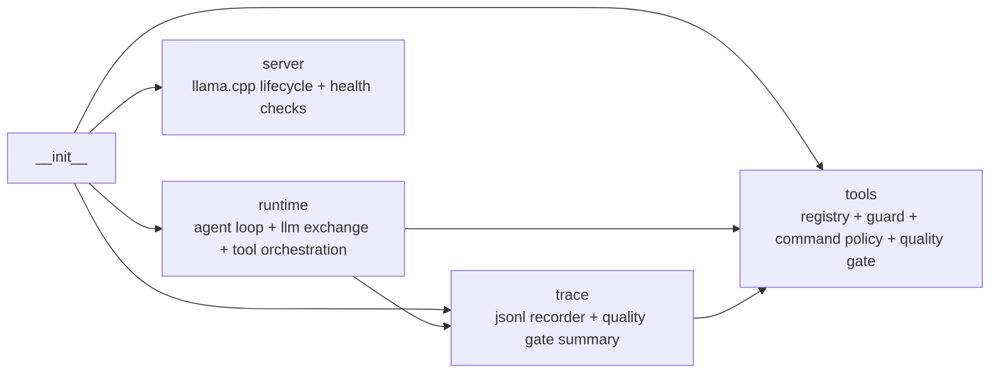
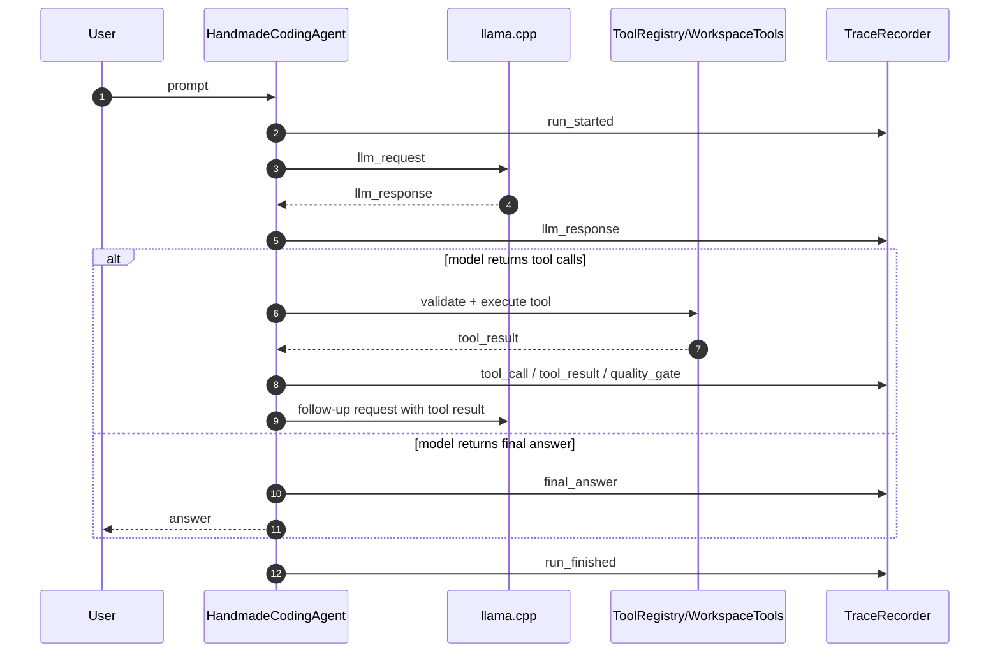
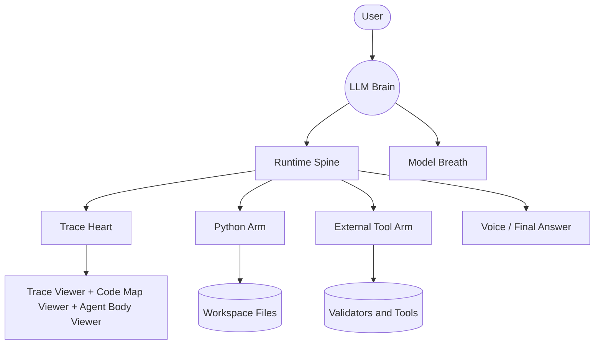
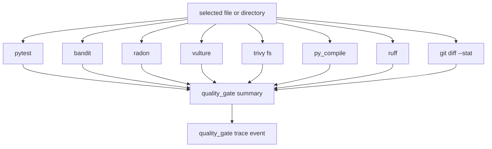

# Architecture Map

This document explains the handmade agent as both a codebase and a learning system.

## Layer View

### Layer 1: Runtime Loop

- `runtime.py`
- owns the main conversation loop
- sends requests to the model
- parses native tool calls or JSON fallback calls
- records trace events
- reuses duplicate tool calls inside the same model response

### Layer 2: Tool and Policy Layer

- `tools.py`
- owns tool registration, schema validation, path boundaries, command allowlists, and quality gates
- this is where filesystem actions and subprocess execution become safe enough to expose for learning

### Layer 3: Model Server Layer

- `server.py`
- owns local llama.cpp startup, readiness checks, and shutdown

### Layer 4: Trace and Observability Layer

- `trace.py`
- owns JSONL event recording and quality-gate summarization
- this is the backbone of replay, visualization, and runtime teaching tools

## Static Module Graph

## Runtime Data Route

## Agent As A Virtual Person

This repository can also be explained as a visible virtual body rather than only as a module graph.

- brain: `runtime.py` LLM exchange, planning, and tool choice
- spine: `runtime.py` run loop and orchestration
- heart: `trace.py` JSONL pulse and replay memory
- left arm: `tools.py` local Python actions
- right arm: `tools.py` plus external validators and quality gates
- breath: `server.py` llama.cpp lifecycle
- voice: final user-facing answer emitted by the runtime

## Quality Gate Route

## Transparency Assets in This Repository

- `scripts/trace_tools.py`: parse trace, summarize run, emit Mermaid sequence
- `scripts/architecture_map.py`: inspect modules and emit Mermaid dependency graph
- `docs/trace_viewer.html`: offline trace viewer for learners
- `docs/code_map_viewer.html`: offline code and route anatomy viewer
- `docs/agent_body_viewer.html`: offline virtual-person viewer that lights up organs from real traces

## What This Repository Teaches Well

- how a local agent loop really works
- how tool safety is enforced
- how quality gates shape the execution path
- how structured traces can be turned into visual explanations

## Current Gaps

- no full trace replay engine yet
- no interactive breakpoint/pause mode yet
- no live streaming dashboard yet
- no automatic architecture graph export pipeline yet
