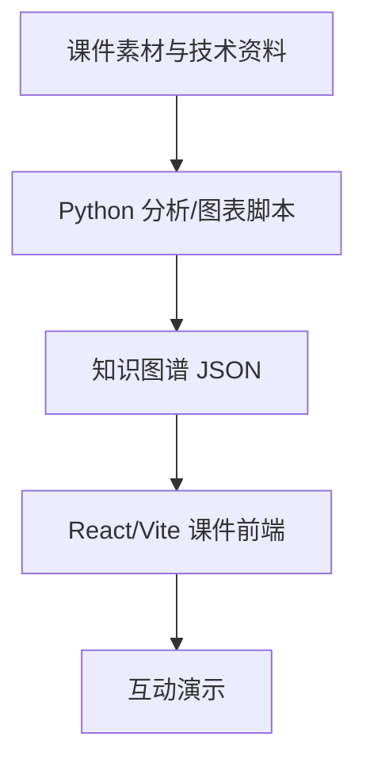

# Agent Runtime 内核互动讲解平台

Agent 全栈深度解析互动课件，以可视化方式阐释 Agent 运行时内核（JMP、State、Channel 三大核心原语）、工具调用机制与多 Agent 编排原理。

## 🏗 架构总览



```
agent-lecture/
├── src/          → React + TypeScript + Vite 前端（SlideShow 课件引擎）
├── scripts/      → Python 脚本（知识图谱构建、图表生成、架构分析）
├── public/       → 架构图 / 时序图 / 概念图 / Mermaid 图
└── data/         → 知识图谱 JSON / 幻灯片定义
```

## 🧠 核心概念可视化

- **Layer 0** – 多故事线入口（武侠 / 生活类比引导）
- **Layer 1** – LLM 训练全景（预训练 → SFT → RLHF）
- **Layer 2** – Runtime 内核（状态机 `State`、跳转 `JMP`、通道 `Channel`）
- **Layer 3** – Agent 操作系统（工具注册、调用链、内存管理）
- **Layer 4** – 多 Agent 编排（路由、fork、通信协议）
- **Layer 5** – 实战工具与扩展

## 🛠 技术栈

| 层       | 技术                         |
| -------- | ---------------------------- |
| 前端     | React 19 + TypeScript + Vite |
| 可视化   | Mermaid.js, Plotly.js, Dagre |
| 动画     | Framer Motion                |
| 数据     | 知识图谱 JSON                |
| 生成脚本 | Python                       |

## 📚 架构文档

详见 [`docs/architecture.md`](docs/architecture.md)（详尽的洋葱模型架构图）或 `tech_architecture_report.json`。架构文档包含完整的内容体系说明、数据库设计、UI 原则与实现路线图。

## 🚀 快速开始

```bash
npm install
npm run dev       # 开发服务器
npm run build     # 构建产物
npm run preview   # 预览构建结果
```
