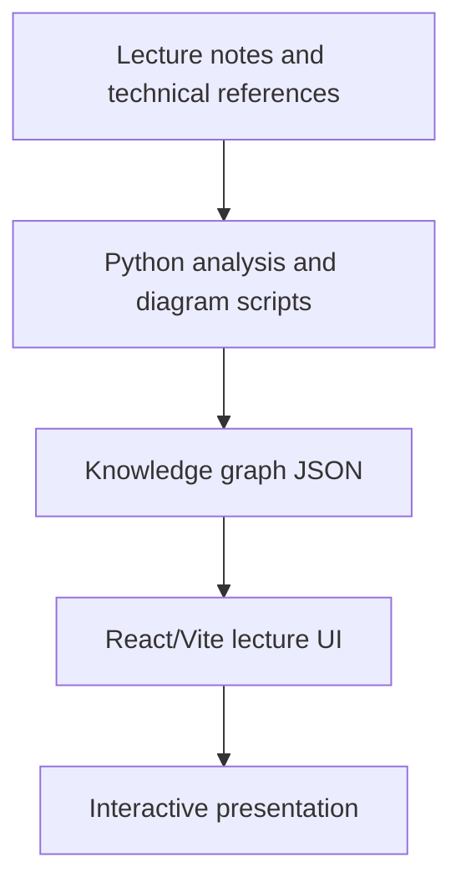

# Agent lecture

Interactive agent-system lecture project built with React, TypeScript, Vite, knowledge-graph assets, and diagram-generation scripts. The repository demonstrates how agent concepts can be explained through a product-style UI and generated technical visuals.

## Architecture

- Detailed overview: [`docs/architecture.md`](docs/architecture.md)
- Mermaid source: [`docs/architecture.mmd`](docs/architecture.mmd)

## Tech stack

| Area | Technology |
| --- | --- |
| Frontend | React, TypeScript, Vite |
| Visualization | Generated diagrams, SVG/PNG assets |
| Knowledge pipeline | Python scripts, knowledge graph JSON |
| Delivery | Static frontend build |

## Repository hygiene

Generated SQLite databases, Python bytecode, test outputs, `node_modules`, and build artifacts are excluded from the public tree.
