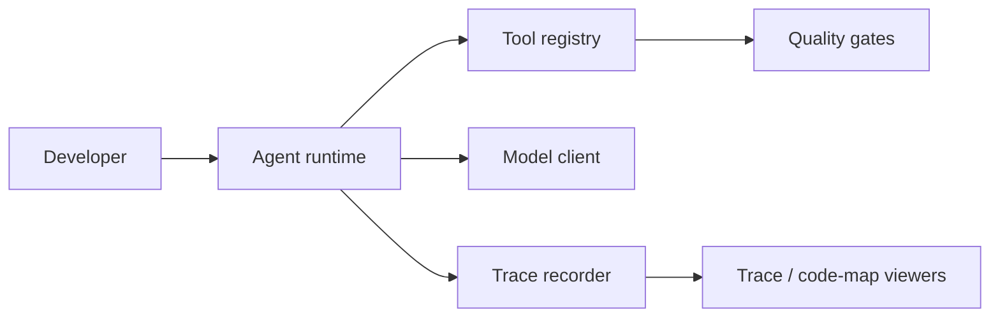

# Architecture

## Main modules

| Module | Purpose |
| --- | --- |
| `runtime.py` | Agent loop and model/tool execution |
| `tools.py` | Tool registry and safety gates |
| `trace.py` | Trace recording and replay |
| `scripts` | Architecture map and trace tooling |

