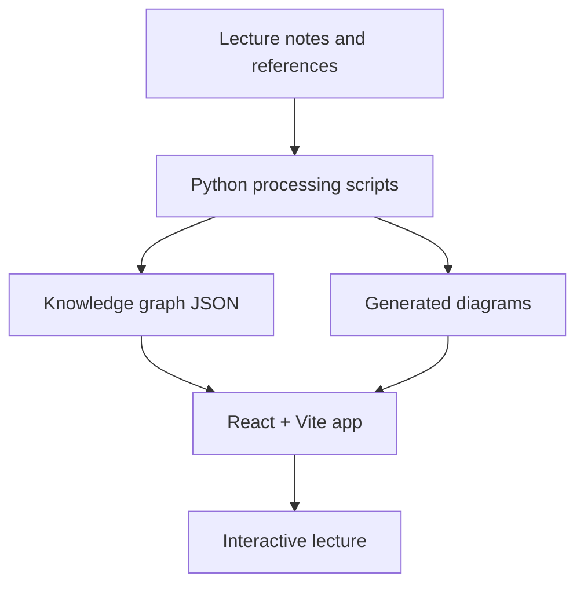

# Agent lecture architecture

## Components

| Component | Role |
| --- | --- |
| `src/` | React presentation UI |
| `scripts/` | Knowledge graph and diagram generation helpers |
| `knowledge_graph.json` | Static knowledge graph consumed by the UI |
| `public/` | Static icons and browser assets |

## Cleanup notes

Runtime/generated databases and test output are not part of the standardized public `main` branch.
